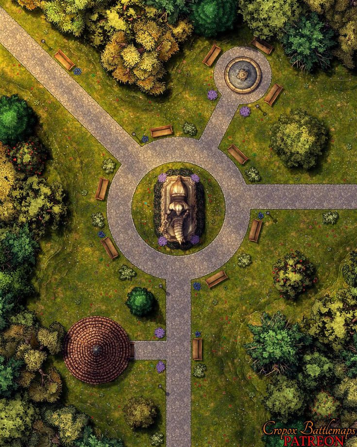

# Сцена 2

*(Подложка: зелень, куча растений)*

---

## Заметки для ДМа

Когда приключенцы подойдут к телу, окружённому кустами,  
дриады/растения пробрасывают **проверки скрытности** — это засада.

---

## Описание сцены

> _Прочитайте вслух:_

***Мощёная дорожка ведёт вглубь святилища. Растительность пробивается сквозь камень и выглядит искажённой.***

***В центре лежит тело человека в зелёном плаще и чёрной кожаной броне, оплетённое корнями.  
На поясе — мёртвая крылатая змея со свитком.  
Когда вы приближаетесь — кусты начинают шевелиться.***

---

## Проверки

- **Medicine DC 12** — смерть от растений.
- **Nature DC 14** — магическое искажение, неестественные процессы.
- **Survival DC 11** — следы канализации на ботинках.

---

## Враги

- **2×**  [Вьющаяся зараза](https://dnd.su/bestiary/46-vine-blight/)
- **3×** [Игольчатая зараза](https://dnd.su/bestiary/45-needle-blight/)
- **1×**  [Пробужденное дерево](https://dnd.su/bestiary/396-awakened-tree/)

---

## Карта

