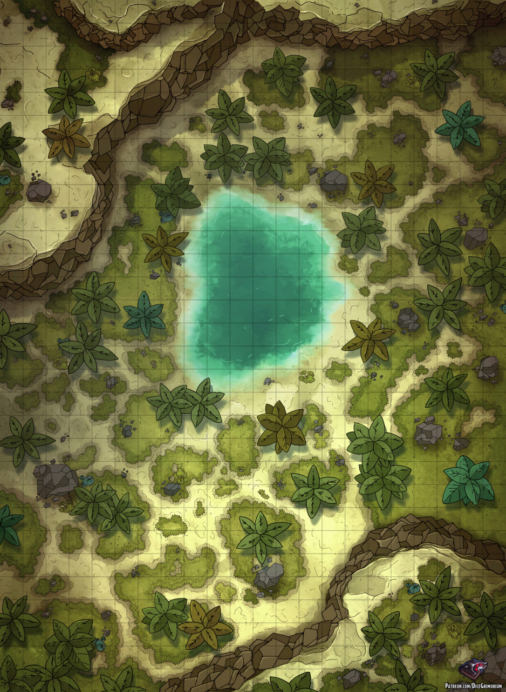

# 🎵
-Подключай [музыку](https://youtu.be/2staFuc00xo)
# Сцена 3

---

## Описание сцены

> _Прочитайте вслух:_

Вы не встречаете ни одного патруля Городской Стражи.  
Лишь напуганные горожане.

Извозчик кричит на углу **Улицы Взглядов** и **Пути Героев**:

***«В парке что-то случилось!»***

Продираясь через заросли, вы видите фигуру, висящую над озером.

***Это Маншун.***

---

## Заметки для ДМа

⚠ **ТУТ ПОЯВЛЯЮСЬ Я КАК ПЕРЕХОДЯЩИЙ БОСС**  
И добавляю хаоса в боёвку.

---

## Враги

- **1×** [Водяной элементаль](https://dnd.su/bestiary/144-water-elemental/)
- **2×** [Паровой мефит](https://dnd.su/bestiary/233-steam-mephit/)

---

## После боя

Появляется крыса, говорящая голосом [[Ria]]:

***«По всему городу природа сходит с ума… Источник под землёй.»***

Если другие группы передали **«гостинцы»**, она их доставит.

---

## Проверки

Игроки, успешно прошедшие одну из проверок **DC 16**, находят вход в канализацию:

- **Investigation**
- **Survival**
- **Perception**

Далее им нужно понять, куда идти:

- с использованием расшифровки записки;
- или без неё — следуя по тянущимся по канализации корням.

---

## Карта

